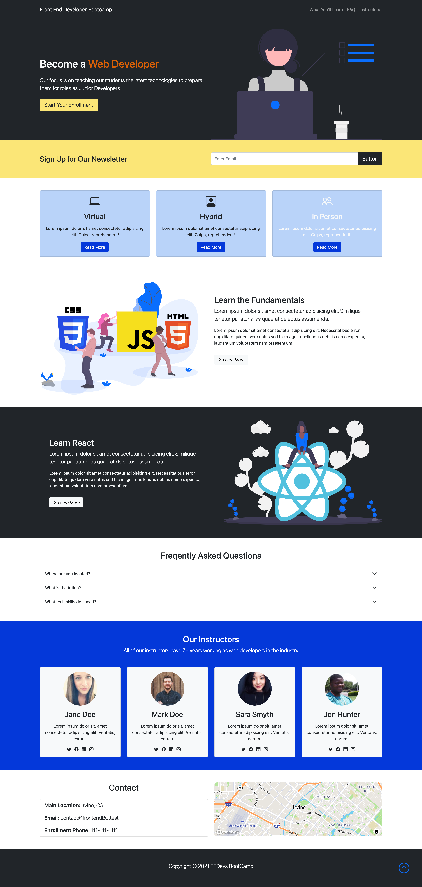

# Responsive Web Page Template using Bootstrap 5

## **Description**
Web Page Template using HTML & CSS & Bootstrap

## **Table of Contents**
* [Installation](#installation)
* [Usage](#usage)
* [Licenses](#licenses)
* [Acknowledgments](#acknowledgments)
* [Badges](#badges)
* [Questions](#questions)

### **Installation**
none

### **Usage**
view site: 
[responsive page](https://jjlindsey.github.io/web-template/)

### **Technologies Used:**
* HTML
* CSS
* Javascript

### *Licenses*
MIT license

### Acknowledgments
This is from a Traversy Media tutorial - you can find the video here:
[video](https://www.youtube.com/watch?v=4sosXZsdy-s)
This was fun to do!

### *Badges*

### *Questions*
If you have any questions, reach out to me on Git Hub https://github.com/JJLindsey, or send me a message jlindsey010@gmail.com.

©Jennifer Lindsey 2021
